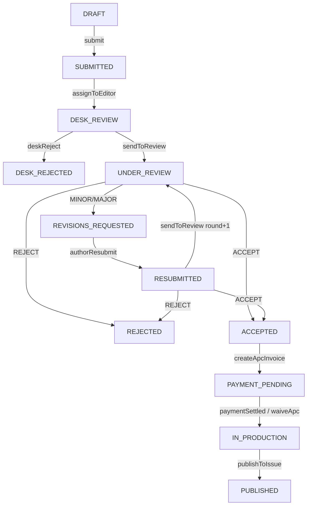

# JMS — Journal Management System (PT. NSD)

SaaS multi-tenant untuk pengelolaan jurnal ilmiah di Indonesia — alternatif custom OJS. Model bisnis **APC** (penulis bayar setelah artikel diterima), kompatibel indeksasi **SINTA & Garuda** (OAI-PMH + Dublin Core).

## Mulai dari sini

1. **`AGENTS.md`** — kontrak untuk AI Agent (Claude Cowork & Cursor). Wajib dibaca sebelum coding.
2. **`documentations/00-index.md`** — indeks rancangan.
3. `documentations/01`–`05` — arsitektur, skema, workflow, integrasi, roadmap.
4. **`documentations/sprints/`** — log tiap sprint + prompt langkah selanjutnya (mulai dari [`s0-foundation.md`](documentations/sprints/s0-foundation.md)).

## Quick start (setelah Sprint 0)

```bash
pnpm install
cp .env.example apps/jms/.env   # lalu isi Supabase/DB
pnpm dev                        # http://localhost:3000
```

## Keputusan arsitektur

- Multi-tenant: shared DB + `journalId` + Postgres RLS.
- Monorepo (pnpm + Turborepo): `apps/jms` + `packages/*` (e-learning di `academy.cursor`, migrasi bertahap).
- Stack: Next.js 16 (App Router) + TypeScript + Prisma + Supabase + Tailwind/shadcn + Resend + Midtrans + Upstash + Sentry.

## Alur editorial inti



Detail transisi, izin per peran, dan anonimitas: `documentations/03-editorial-workflow.md`.
