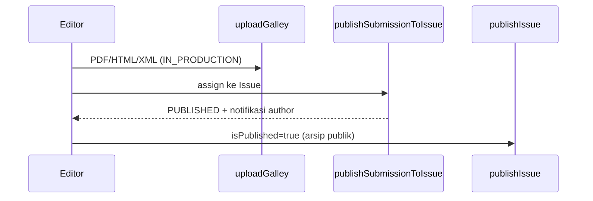

# Sprint 10 — Issue, Galley & Publish

| | |
|---|---|
| **Status** | ✅ Selesai |
| **Tanggal** | 2026-06-09 |
| **Roadmap** | `05-repo-shared-roadmap.md` §2 — Fase 3, S10 |
| **Prasyarat** | ✅ Sprint 9 selesai (`s9-notifications.md`) |

---

## Tujuan

Manajemen issue jurnal, unggah galley (PDF/HTML/XML), terbitkan artikel ke issue, dan arsip publik terbitan — jalur `IN_PRODUCTION → PUBLISHED`.

---

## Deliverable (checklist)

- [x] Domain `domain/publishing/` — validasi issue & galley
- [x] `createIssue`, `listIssues`, `publishIssue`
- [x] `uploadGalley` — storage + `Galley` + `transitionSubmission(uploadGalley)`
- [x] `publishSubmissionToIssue` — `transitionSubmission(publishToIssue)` + guard galley wajib
- [x] `getProductionDetail`, `listInProductionSubmissions`
- [x] Arsip publik `/issues`, `/issues/[id]` + unduh galley `/api/galleys/...`
- [x] UI editorial `/editorial/issues` + panel produksi di `/editorial/submissions/[id]`
- [x] E2e smoke `/api/health/publishing`
- [x] Vitest: `publishing-domain.test.ts`, `publishing-workflow.test.ts`
- [x] Update `06-sprint-log.md`
- [x] DoD: `pnpm lint` + `pnpm typecheck` + `pnpm test`

---

## Lokasi penting

```
apps/jms/src/
├── domain/publishing/
│   ├── types.ts
│   ├── galley.ts
│   └── issue.ts
├── application/publishing/
│   ├── create-issue.ts
│   ├── list-issues.ts
│   ├── publish-issue.ts
│   ├── upload-galley.ts
│   ├── publish-submission-to-issue.ts
│   ├── get-production-detail.ts
│   ├── list-in-production-submissions.ts
│   ├── get-published-archive.ts
│   ├── get-galley-download-url.ts
│   └── get-publishing-health.ts
├── infrastructure/publishing/
│   ├── issue-repository.ts
│   └── galley-repository.ts
└── app/
    ├── editorial/issues/
    ├── issues/                    # arsip publik tenant
    └── api/
        ├── health/publishing/
        └── galleys/[submissionId]/[galleyId]/
```

---

## Alur terbit (ringkas)



---

## Verifikasi (Definition of Done)

```bash
pnpm install
pnpm lint
pnpm typecheck
pnpm test
pnpm test:e2e
```

---

## Keputusan & catatan

- `publishToIssue` memerlukan minimal satu galley (guard state machine diperbarui S10).
- Unduh galley publik hanya untuk submission `PUBLISHED` (signed URL).
- `publishIssue` membuat issue terlihat di `/issues`; artikel individual sudah `PUBLISHED` sebelumnya.

---

## Yang sengaja belum ada (Sprint 11+)

| Item | Sprint |
|------|--------|
| OAI-PMH + Dublin Core | S11 |
| CrossRef DOI deposit | S12 |
| APC billing + webhook | S13 |

---

## Prompt — langkah selanjutnya (Sprint 11)

```
Sprint 10 selesai. Baca documentations/sprints/s10-issue-galley-publish.md.

Lanjut Sprint 11 (05-repo-shared-roadmap.md §2 — Fase 3):
1. OAI-PMH + Dublin Core endpoint + validasi.
2. DoD hijau. Jangan lompat sprint kecuali diminta.
```
