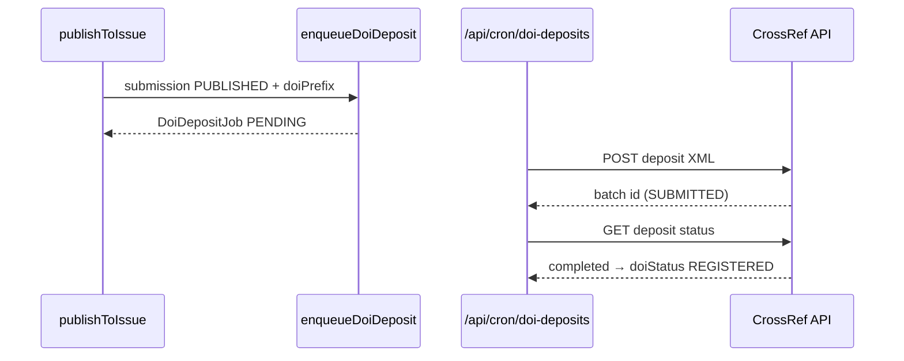

# Sprint 12 — CrossRef DOI Deposit + Job Retry

| | |
|---|---|
| **Status** | ✅ Selesai |
| **Tanggal** | 2026-06-09 |
| **Roadmap** | `05-repo-shared-roadmap.md` §2 — Fase 3, S12 |
| **Prasyarat** | ✅ Sprint 11 selesai (`s11-oai-pmh-dublin-core.md`) |

---

## Tujuan

Deposit metadata artikel terbit ke CrossRef untuk registrasi DOI, dengan antrian job tenant-scoped, retry backoff, dan polling status deposit.

---

## Deliverable (checklist)

- [x] Domain `domain/doi/` — identifier, retry backoff, types
- [x] `infrastructure/crossref/` — XML builder 5.4.0, deposit client, credentials, repository
- [x] `DoiDepositJob` Prisma + RLS
- [x] `enqueueDoiDeposit` — dipicu saat `publishToIssue` (jika `Journal.doiPrefix` ada)
- [x] `processDoiDeposit` + `processPendingDoiDeposits` (cron retry + poll `SUBMITTED`)
- [x] Idempotensi via `ProcessedWebhook` (`crossref:deposit:<journalId>:<submissionId>`)
- [x] Route `GET /api/cron/doi-deposits` + health `/api/health/doi`
- [x] Vitest: `doi-domain.test.ts`
- [x] E2e smoke `/api/health/doi` + cron
- [x] Update `06-sprint-log.md`
- [x] DoD: `pnpm lint` + `pnpm typecheck` + `pnpm test`

---

## Lokasi penting

```
apps/jms/src/
├── domain/doi/
│   ├── types.ts
│   ├── identifier.ts
│   └── retry.ts
├── application/doi/
│   ├── enqueue-doi-deposit.ts
│   ├── process-doi-deposit.ts
│   ├── process-pending-doi-deposits.ts
│   └── get-doi-health.ts
├── infrastructure/crossref/
│   ├── xml-builder.ts
│   ├── deposit-client.ts
│   ├── credentials.ts
│   └── doi-repository.ts
└── app/api/
    ├── cron/doi-deposits/route.ts
    └── health/doi/route.ts
```

---

## Alur deposit (ringkas)



---

## Konfigurasi env

| Variabel | Fungsi |
|----------|--------|
| `CROSSREF_DEPOSITOR_EMAIL` | Akun depositor CrossRef |
| `CROSSREF_DEPOSITOR_PASSWORD` | Password default platform |
| `CROSSREF_DEPOSITOR_NAME` | Nama depositor (opsional) |
| `CROSSREF_REGISTRANT` | Registrant metadata (opsional) |
| `CROSSREF_IS_PRODUCTION` | `false` = `api.test.crossref.org` |

Per jurnal: `Journal.doiPrefix`, `crossrefDepositorName`, `crossrefCredentialRef` (nama env var password khusus jurnal).

---

## Verifikasi (Definition of Done)

```bash
pnpm install
pnpm lint
pnpm typecheck
pnpm test
pnpm test:e2e
```

---

## Keputusan & catatan

- DOI suffix: `article.<submissionId>`; prefix dari `Journal.doiPrefix`.
- Retry backoff: 1m → 5m → 15m → 1h → 4h (maks 5 percobaan).
- Tanpa `doiPrefix` jurnal, deposit tidak diantrikan (DOI opsional per jurnal).
- Landing URL artikel: `/issues/<issueId>#article-<submissionId>` (sama dengan OAI).

---

## Yang sengaja belum ada (Sprint 13+)

| Item | Sprint |
|------|--------|
| APC billing + webhook | S13 |
| Retraction/correction DOI update | Lanjut |

---

## Prompt — langkah selanjutnya (Sprint 13)

```
Sprint 12 selesai. Baca documentations/sprints/s12-crossref-doi-deposit.md.

Lanjut Sprint 13 (05-repo-shared-roadmap.md §2 — Fase 4):
1. APC invoice (timing setelah accept) + payment adaptor + webhook.
2. DoD hijau. Jangan lompat sprint kecuali diminta.
```
