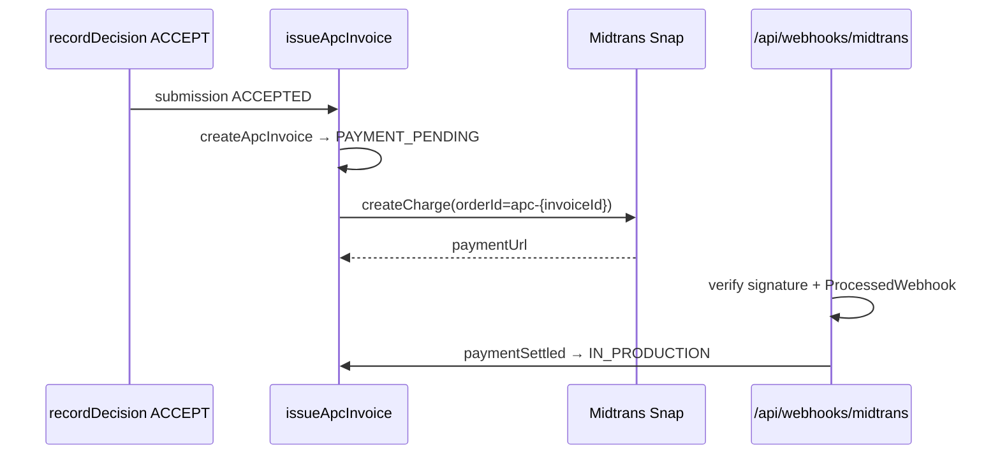

# Sprint 13 — APC Billing + Payment Adaptor + Webhook

| | |
|---|---|
| **Status** | ✅ Selesai |
| **Tanggal** | 2026-06-09 |
| **Roadmap** | `05-repo-shared-roadmap.md` §2 — Fase 4, S13 |
| **Prasyarat** | ✅ Sprint 12 selesai (`s12-crossref-doi-deposit.md`) |

---

## Tujuan

Invoice APC otomatis setelah artikel `ACCEPTED`, integrasi gateway Midtrans (platform-as-merchant), webhook idempoten → `paymentSettled` → `IN_PRODUCTION`.

---

## Deliverable (checklist)

- [x] Domain `domain/billing/` — order id, settlement rules, types
- [x] `infrastructure/payment/` — adaptor config, APC repository, `ProcessedWebhook` store
- [x] `issueApcInvoice` — dipicu otomatis setelah `recordDecision` ACCEPT
- [x] Midtrans Snap charge + simpan `paymentUrl` / `externalRef` di `ApcInvoice`
- [x] `processMidtransWebhook` — verifikasi signature, idempotensi, `PaymentTransaction`, `paymentSettled`
- [x] Route `POST /api/webhooks/midtrans` + health `/api/health/billing`
- [x] Vitest: `billing-domain.test.ts`
- [x] E2e smoke `/api/health/billing` + webhook validasi payload
- [x] Update `06-sprint-log.md`
- [x] DoD: `pnpm lint` + `pnpm typecheck` + `pnpm test`

---

## Lokasi penting

```
apps/jms/src/
├── domain/billing/
│   ├── types.ts
│   ├── order-id.ts
│   └── settlement.ts
├── application/billing/
│   ├── issue-apc-invoice.ts
│   ├── process-midtrans-webhook.ts
│   └── get-billing-health.ts
├── infrastructure/payment/
│   ├── payment-config.ts
│   ├── apc-invoice-repository.ts
│   └── processed-webhook-store.ts
└── app/api/
    ├── webhooks/midtrans/route.ts
    └── health/billing/route.ts

packages/payments/          # adaptor Midtrans + idempotensi generik
```

---

## Alur APC (ringkas)



---

## Konfigurasi env

| Variabel | Fungsi |
|----------|--------|
| `MIDTRANS_SERVER_KEY` | Server key Snap/Core API |
| `NEXT_PUBLIC_MIDTRANS_CLIENT_KEY` | Client key (frontend, fase lanjut) |
| `MIDTRANS_IS_PRODUCTION` | `false` = sandbox |
| `NEXT_PUBLIC_APP_URL` | Callback finish + webhook base URL |

APC nol (`Journal.apcAmount = 0`) → loncat ke `IN_PRODUCTION` tanpa invoice (S6).

---

## Verifikasi (Definition of Done)

```bash
pnpm install
pnpm lint
pnpm typecheck
pnpm test
pnpm test:e2e
```

---

## Keputusan & catatan

- Model billing: **platform-as-merchant** (satu akun Midtrans NSD).
- Order id: `apc-{invoiceId}` — memetakan webhook ke invoice tenant-scoped.
- Notifikasi invoice dikirim dari `issueApcInvoice` (setelah `paymentUrl` tersedia).
- Gateway Duitku/Xendit: adaptor ada di `packages/payments`; integrasi JMS ditunda S14+.

---

## Yang sengaja belum ada (Sprint 14+)

| Item | Sprint |
|------|--------|
| Waiver/diskon, ledger/payout multi-tenant | S14 |
| UI checkout embedded Snap | Lanjut |
| Xendit webhook | Lanjut |

---

## Prompt — langkah selanjutnya (Sprint 14)

```
Sprint 13 selesai. Baca documentations/sprints/s13-apc-billing.md.

Lanjut Sprint 14 (05-repo-shared-roadmap.md §2 — Fase 4):
1. Waiver/diskon APC + ledger/payout multi-tenant.
2. DoD hijau. Jangan lompat sprint kecuali diminta.
```
