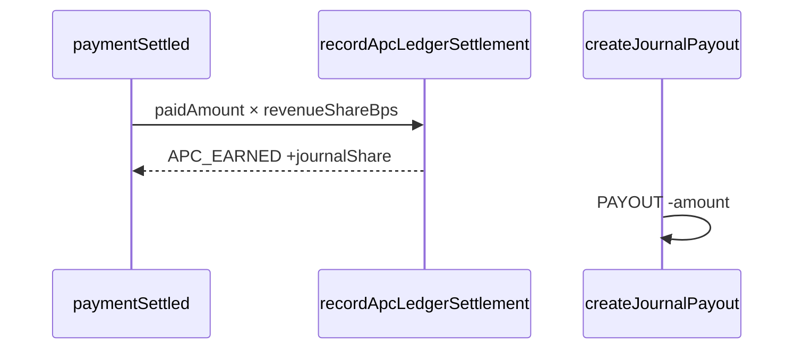

# Sprint 14 — Waiver/Diskon APC + Ledger/Payout Multi-tenant

| | |
|---|---|
| **Status** | ✅ Selesai |
| **Tanggal** | 2026-06-09 |
| **Roadmap** | `05-repo-shared-roadmap.md` §2 — Fase 4, S14 |
| **Prasyarat** | ✅ Sprint 13 selesai (`s13-apc-billing.md`) |

---

## Tujuan

Waiver penuh & diskon parsial APC oleh Journal Admin; buku besar pendapatan per jurnal (platform-as-merchant) + pencatatan payout.

---

## Deliverable (checklist)

- [x] Domain `domain/billing/` — discount, revenue-split, ledger types
- [x] Prisma `JournalLedgerEntry`, `JournalPayout`, `ApcInvoice.originalAmount`, `Journal.apcRevenueShareBps` + RLS
- [x] `applyApcDiscount` — diskon nominal/persen, refresh Snap charge
- [x] `waiveApc` — waiver penuh → `IN_PRODUCTION` via `transitionSubmission`
- [x] `recordApcLedgerSettlement` — kredit jurnal saat `paymentSettled`
- [x] `createJournalPayout` + `getJournalBillingSummary`
- [x] Notifikasi `APC_WAIVED` ke author
- [x] Vitest: perluasan `billing-domain.test.ts`
- [x] E2e smoke `/api/health/billing` (fitur S14)
- [x] Update `06-sprint-log.md`
- [x] DoD: `pnpm lint` + `pnpm typecheck` + `pnpm test`

---

## Lokasi penting

```
apps/jms/src/
├── domain/billing/
│   ├── discount.ts
│   ├── revenue-split.ts
│   ├── ledger.ts
│   └── errors.ts
├── application/billing/
│   ├── apply-apc-discount.ts
│   ├── waive-apc.ts
│   ├── record-apc-ledger-settlement.ts
│   ├── create-journal-payout.ts
│   └── get-journal-billing-summary.ts
└── infrastructure/payment/
    ├── ledger-repository.ts
    └── create-apc-charge.ts
```

---

## Alur ledger (ringkas)



Model **platform-as-merchant**: APC masuk akun NSD; ledger mencatat bagian jurnal (`apcRevenueShareBps`, default 85%). Payout men-debit saldo saat transfer ke rekening jurnal.

---

## Verifikasi (Definition of Done)

```bash
pnpm install
pnpm lint
pnpm typecheck
pnpm test
pnpm test:e2e
pnpm db:generate
```

---

## Keputusan & catatan

- Diskon 100% otomatis memicu `waiveApc`.
- Setelah diskon, Snap charge di-refresh agar `gross_amount` webhook cocok dengan `invoice.amount`.
- Payout dicatat oleh `JOURNAL_ADMIN` (bookkeeping settlement).

---

## Yang sengaja belum ada (Sprint 15+)

| Item | Sprint |
|------|--------|
| UI checkout embedded Snap | Lanjut |
| Dashboard statistik jurnal | S15 |
| Xendit webhook | Lanjut |

---

## Prompt — langkah selanjutnya (Sprint 15)

```
Sprint 14 selesai. Baca documentations/sprints/s14-apc-waiver-ledger.md.

Lanjut Sprint 15 (05-repo-shared-roadmap.md §2 — Fase 5):
1. Dashboard statistik per jurnal.
2. DoD hijau. Jangan lompat sprint kecuali diminta.
```
