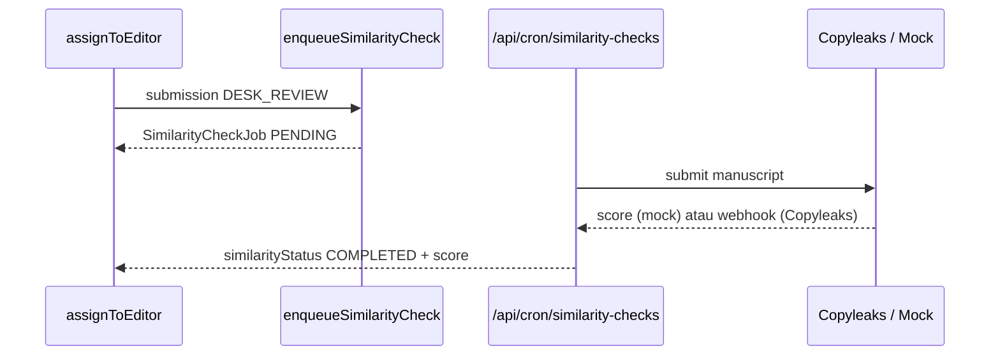

# Sprint 16 — Similarity Check (Integrasi API)

| | |
|---|---|
| **Status** | ✅ Selesai |
| **Tanggal** | 2026-06-09 |
| **Roadmap** | `05-repo-shared-roadmap.md` §2 — Fase 5, S16 |
| **Prasyarat** | ✅ Sprint 15 selesai (`s15-journal-statistics-dashboard.md`) |

---

## Tujuan

Integrasi similarity check via adaptor provider: antrian job tenant-scoped, Copyleaks API (production) + mock provider (dev/CI), webhook hasil, dan tampilan skor di desk review sebelum `sendToReview`.

---

## Deliverable (checklist)

- [x] Domain `domain/similarity/` — types, retry backoff, score classification
- [x] `infrastructure/similarity/` — provider interface, Mock + Copyleaks adaptor
- [x] `SimilarityCheckJob` Prisma + RLS; `Submission.similarityReportUrl`
- [x] `enqueueSimilarityCheck` — dipicu saat `assignToEditor`
- [x] `processSimilarityCheck` + `processPendingSimilarityChecks` (cron)
- [x] Webhook `POST /api/webhooks/copyleaks` + idempotensi `ProcessedWebhook`
- [x] Route `GET /api/cron/similarity-checks` + health `/api/health/similarity`
- [x] UI desk review — kartu similarity (status, skor, laporan)
- [x] Vitest: `similarity-domain.test.ts`
- [x] E2e smoke `/api/health/similarity` + cron
- [x] Update `06-sprint-log.md`
- [x] DoD: `pnpm lint` + `pnpm typecheck` + `pnpm test`

---

## Lokasi penting

```
apps/jms/src/
├── domain/similarity/
│   ├── types.ts
│   ├── retry.ts
│   └── score.ts
├── application/similarity/
│   ├── enqueue-similarity-check.ts
│   ├── process-similarity-check.ts
│   ├── process-pending-similarity-checks.ts
│   ├── handle-copyleaks-webhook.ts
│   └── get-similarity-health.ts
├── infrastructure/similarity/
│   ├── provider.ts
│   ├── mock-provider.ts
│   ├── copyleaks-client.ts
│   ├── copyleaks-provider.ts
│   ├── credentials.ts
│   ├── resolve-provider.ts
│   └── similarity-repository.ts
└── app/api/
    ├── cron/similarity-checks/route.ts
    ├── health/similarity/route.ts
    └── webhooks/copyleaks/route.ts
```

---

## Alur (ringkas)



---

## Konfigurasi env

| Variabel | Fungsi |
|----------|--------|
| `COPYLEAKS_EMAIL` | Akun Copyleaks |
| `COPYLEAKS_API_KEY` | API key (UUID) |
| `COPYLEAKS_IS_SANDBOX` | `true` = sandbox (default) |

Tanpa kredensial Copyleaks: **MockSimilarityProvider** (deterministik dari hash file).

---

## Verifikasi (Definition of Done)

```bash
pnpm install
pnpm lint
pnpm typecheck
pnpm test
pnpm test:e2e
```

---

## Keputusan & catatan

- Dipicu saat `assignToEditor` (masuk `DESK_REVIEW`), bukan saat `submit`.
- Threshold peringatan editor: ≥25% = severity `high` (domain constant).
- Copyleaks webhook membutuhkan URL publik; localhost memakai mock/cron tanpa webhook.
- `sendToReview` tidak diblokir otomatis — editor melihat skor dan memutuskan.

---

## Yang sengaja belum ada (Sprint 17+)

| Item | Sprint |
|------|--------|
| AI auto-assign reviewer | ✅ S17 (`s17-ai-reviewer-matching.md`) |
| iThenticate/Turnitin adaptor | Lanjut |
| Blokir otomatis `sendToReview` jika skor tinggi | Lanjut |

---

## Prompt — langkah selanjutnya (Sprint 17)

```
Sprint 16 selesai. Baca documentations/sprints/s16-similarity-check.md.

Lanjut Sprint 17 (05-repo-shared-roadmap.md §2 — Fase 5):
1. AI auto-assign reviewer (keyword → embedding).
2. DoD hijau. Jangan lompat sprint kecuali diminta.
```
