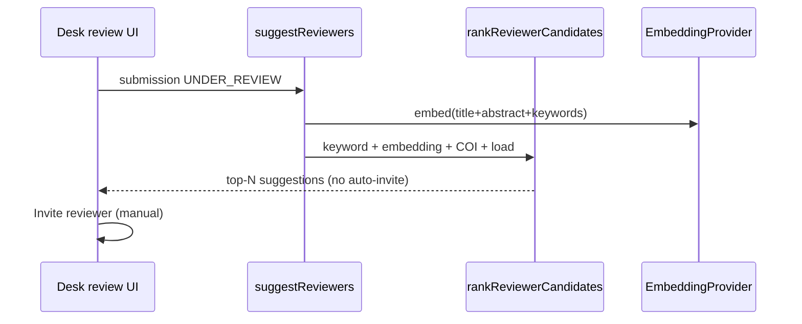

# Sprint 17 — AI Auto-Assign Reviewer (Keyword → Embedding)

| | |
|---|---|
| **Status** | ✅ Selesai |
| **Tanggal** | 2026-06-09 |
| **Roadmap** | `05-repo-shared-roadmap.md` §2 — Fase 5, S17 |
| **Prasyarat** | ✅ Sprint 16 selesai (`s16-similarity-check.md`) |

---

## Tujuan

Saran reviewer berbasis kecocokan kata kunci + embedding semantik (abstrak/keywords submission ↔ profil reviewer). Filter beban (`maxLoad`) dan peringatan konflik kepentingan. **Output = saran** — editor tetap mengundang secara manual.

---

## Deliverable (checklist)

- [x] Domain `domain/reviewer-matching/` — keyword overlap, cosine similarity, ranking
- [x] `infrastructure/ai/` — EmbeddingProvider, Mock + OpenAI adaptor
- [x] `suggestReviewers` — otorisasi editor, COI, maxLoad, top-N
- [x] UI desk review — kartu saran reviewer + tautan undang
- [x] Health `/api/health/reviewer-matching`
- [x] Vitest: `reviewer-matching-domain.test.ts`
- [x] E2e smoke `/api/health/reviewer-matching`
- [x] Update `06-sprint-log.md`
- [x] DoD: `pnpm lint` + `pnpm typecheck` + `pnpm test`

---

## Lokasi penting

```
apps/jms/src/
├── domain/reviewer-matching/
│   ├── types.ts
│   ├── keywords.ts
│   ├── embedding.ts
│   └── rank.ts
├── application/reviewer-matching/
│   ├── suggest-reviewers.ts
│   └── get-reviewer-matching-health.ts
├── infrastructure/ai/
│   ├── embedding-provider.ts
│   ├── mock-embedding-provider.ts
│   ├── openai-embedding-provider.ts
│   ├── credentials.ts
│   ├── resolve-embedding-provider.ts
│   └── reviewer-matching-repository.ts
└── app/
    ├── api/health/reviewer-matching/route.ts
    └── editorial/submissions/[id]/page.tsx
```

---

## Alur (ringkas)



---

## Konfigurasi env

| Variabel | Fungsi |
|----------|--------|
| `OPENAI_API_KEY` | OpenAI embeddings (production) |
| `OPENAI_EMBEDDING_MODEL` | Model embedding (default `text-embedding-3-small`) |

Tanpa kredensial OpenAI: **MockEmbeddingProvider** (vektor deterministik dari hash teks).

---

## Verifikasi (Definition of Done)

```bash
pnpm install
pnpm lint
pnpm typecheck
pnpm test
pnpm test:e2e
```

---

## Keputusan & catatan

- Saran hanya ditampilkan saat status `UNDER_REVIEW` (editor dapat mengundang reviewer).
- Skor gabungan: 40% keyword + 60% embedding bila embedding tersedia; keyword-only jika tidak.
- `AUTHOR_IS_REVIEWER` dikecualikan dari saran; afiliasi/email sama tetap ditampilkan dengan peringatan COI.
- Reviewer tanpa `ReviewerProfile` tetap dipertimbangkan (keyword kosong, `maxLoad` default 3).
- Tidak ada auto-invite — akuntabilitas editorial tetap pada editor.

---

## Yang sengaja belum ada (Sprint 18+)

| Item | Sprint |
|------|--------|
| Persistensi embedding reviewer otomatis (cron/on-profile-update) | ✅ S18 (`s18-reviewer-embedding-persistence.md`) |
| iThenticate/Turnitin adaptor similarity | Lanjut |
| Blokir otomatis `sendToReview` jika skor similarity tinggi | Lanjut |

---

## Prompt — langkah selanjutnya

Roadmap Fase 5 (S15–S17) selesai. Jalur kritis MVP (S0–S3, S5–S11, S13) sudah hijau.

Opsi lanjutan di luar sprint berikutnya:
- Persistensi embedding reviewer + re-rank batch
- Integrasi similarity iThenticate/Turnitin
- Compliance & operasional dari `05-repo-shared-roadmap.md` §3

DoD penuh diverifikasi 2026-06-09 (`lint`, `typecheck`, `test` 182, `build`, `test:e2e` 19). Checklist deploy: [`07-production-deploy-checklist.md`](../07-production-deploy-checklist.md). Sprint berikutnya: [`s18-reviewer-embedding-persistence.md`](./s18-reviewer-embedding-persistence.md).
