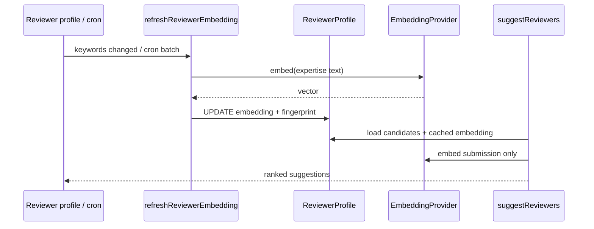

# Sprint 18 — Persistensi Embedding Reviewer + Re-rank Batch

| | |
|---|---|
| **Status** | ✅ Selesai |
| **Tanggal** | 2026-06-09 |
| **Roadmap** | Lanjutan S17 (`s17-ai-reviewer-matching.md`) |
| **Prasyarat** | ✅ Sprint 17 selesai |

---

## Tujuan

Hindari pemanggilan embedding API berulang saat `suggestReviewers`: simpan vektor reviewer di `ReviewerProfile.embedding`, refresh otomatis saat profil berubah, dan proses batch via cron untuk profil yang belum/butuh re-embed. `suggestReviewers` memakai cache DB; reviewer tanpa embedding di-rank keyword-only (sama seperti S17).

---

## Deliverable (checklist)

- [x] Migrasi Prisma — `ReviewerProfile.embeddingModel`, `embeddingSourceHash`
- [x] Domain `domain/reviewer-matching/embedding.ts` — `shouldRefreshEmbedding`, `embeddingSourceFingerprint`
- [x] `upsertReviewerProfile` — otorisasi reviewer/journal admin; validasi keywords; refresh embedding
- [x] `refreshReviewerEmbedding` — embed `buildReviewerExpertiseText(keywords)` → simpan ke `ReviewerProfile.embedding`
- [x] `processPendingReviewerEmbeddings` — batch tenant-safe (via `adminDb` + filter jurnal aktif); batas 50/run; skip jika keywords kosong
- [x] Route `GET /api/cron/reviewer-embeddings` + auth `CRON_SECRET` (pola `similarity-checks`)
- [x] Perluas health `/api/health/reviewer-matching` — `embeddingPersistence`, `pendingRefreshCount`
- [x] Refactor `suggestReviewers` — baca embedding dari DB; tidak embed on-the-fly; flag `embeddingStale` di response
- [x] UI minimal: form edit keywords/maxLoad reviewer di editorial dashboard
- [x] Vitest: domain `shouldRefreshEmbedding` + use-case refresh (mock provider)
- [x] E2e smoke `/api/cron/reviewer-embeddings` + health fields
- [x] Update `06-sprint-log.md` + `02-data-schema.md`
- [x] DoD: `pnpm lint` + `pnpm typecheck` + `pnpm test` + `pnpm test:e2e`

---

## Lokasi penting

```
apps/jms/src/
├── domain/reviewer-matching/
│   ├── embedding.ts              # shouldRefreshEmbedding, embeddingSourceFingerprint
│   └── types.ts                  # REVIEWER_EMBEDDING_BATCH_LIMIT, MOCK_EMBEDDING_MODEL_ID
├── application/reviewer-matching/
│   ├── upsert-reviewer-profile.ts
│   ├── refresh-reviewer-embedding.ts
│   ├── process-pending-reviewer-embeddings.ts
│   ├── suggest-reviewers.ts      # refactor: cache DB, embeddingStale
│   └── get-reviewer-matching-health.ts
├── infrastructure/ai/
│   ├── reviewer-profile-repository.ts
│   └── resolve-embedding-model-id.ts
├── app/
│   ├── api/cron/reviewer-embeddings/route.ts
│   ├── api/health/reviewer-matching/route.ts
│   └── editorial/dashboard/      # form profil reviewer + actions.ts
└── prisma/migrations/
    └── 20260609150000_s18_reviewer_embedding_fingerprint/
```

---

## Alur (ringkas)



---

## Skema (migrasi Prisma)

| Kolom baru | Tipe | Fungsi |
|------------|------|--------|
| `embeddingModel` | `String?` | Model ID saat embed terakhir (`text-embedding-3-small` atau `mock-embedding-v1`) |
| `embeddingSourceHash` | `String?` | Fingerprint keywords — skip re-embed jika tidak berubah |

`shouldRefreshEmbedding()` membandingkan `embeddingModel` + `embeddingSourceHash` sebelum memanggil provider.

---

## Konfigurasi env

| Variabel | Fungsi |
|----------|--------|
| `OPENAI_API_KEY` | Production embeddings |
| `OPENAI_EMBEDDING_MODEL` | Default `text-embedding-3-small` |
| `CRON_SECRET` | Auth cron reviewer-embeddings |

Vercel Cron: `0 2 * * *` di `apps/jms/vercel.json` → `/api/cron/reviewer-embeddings`.

---

## Verifikasi (Definition of Done)

```bash
pnpm install
pnpm lint
pnpm typecheck
pnpm test
pnpm test:e2e
```

**Hasil 2026-06-09:** `lint` ✅ · `typecheck` ✅ · `test` 188 ✅ · `build` ✅ · `test:e2e` 21 ✅

**Migrasi DB:** `prisma migrate deploy` (S18 applied). Jika `migrate dev` gagal karena checksum migrasi lama dimodifikasi, sinkronkan checksum di `_prisma_migrations` atau pakai `migrate deploy` di CI/production.

---

## Keputusan & catatan

- Refresh **tidak** blocking pada `suggestReviewers` — saran tetap cepat; reviewer tanpa embedding di-rank keyword-only.
- Batch cron: max **50** profil per run (`REVIEWER_EMBEDDING_BATCH_LIMIT`).
- `embedding` disimpan sebagai `number[]` JSON (`parseEmbeddingVector`).
- `ReviewerProfile` global per user (bukan per jurnal); keywords shared across journals.
- `upsertReviewerProfile` memicu `refreshReviewerEmbedding` langsung (bukan antrian terpisah).
- UI profil reviewer di `/editorial/dashboard?actorId=...` (dev hingga auth terhubung).

---

## Yang sengaja di luar scope S18

| Item | Sprint |
|------|--------|
| iThenticate/Turnitin adaptor similarity | S19+ |
| Blokir otomatis `sendToReview` jika similarity tinggi | S19+ |
| Compliance & operasional (`05` §3) | Sprint terpisah / checklist deploy |

---

## Prompt — langkah selanjutnya

Roadmap Fase 5 (S15–S18) selesai. Jalur kritis MVP (S0–S3, S5–S11, S13) sudah hijau.

Salin blok ini ke chat AI Agent untuk **sprint lanjutan** (pilih salah satu jalur):

```
Sprint 18 selesai. Baca documentations/sprints/s18-reviewer-embedding-persistence.md.

Opsi A — Similarity lanjutan (disarankan S19):
1. Adaptor iThenticate/Turnitin (selain Copyleaks).
2. Opsional: blokir/peringatan `sendToReview` jika skor similarity tinggi.
3. DoD hijau. Ikuti AGENTS.md.

Opsi B — Compliance & operasional:
1. Kerjakan checklist dari documentations/05-repo-shared-roadmap.md §3.
2. Sinkronkan documentations/07-production-deploy-checklist.md.
3. DoD hijau.

Jangan lompat tanpa persetujuan. Setelah selesai: checklist ✅, update 06-sprint-log.md, prompt langkah selanjutnya.
```

DoD penuh diverifikasi 2026-06-09. Checklist deploy: [`07-production-deploy-checklist.md`](../07-production-deploy-checklist.md).
