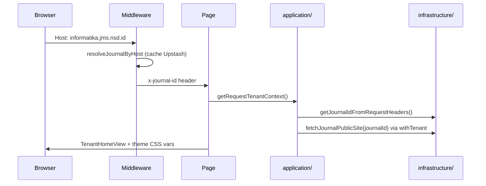

# Sprint 3 — White-label + Locale

| | |
|---|---|
| **Status** | ✅ Selesai |
| **Tanggal** | 2026-06-09 |
| **Roadmap** | `05-repo-shared-roadmap.md` §2 — Fase 1, S3 |
| **Prasyarat** | ✅ Sprint 2 selesai (`s2-tenant-identity.md`) |

---

## Tujuan

Render halaman publik per tenant (branding `JournalTheme` + konten `JournalPage`), resolusi tenant dari header `x-journal-id` (tanpa duplikasi lookup host), dan locale UI `id`/`en` via **next-intl** dengan default dari `JournalTheme.locale`.

---

## Deliverable (checklist)

- [x] Halaman publik tenant: home `/` + halaman statis `/pages/[slug]` (about, guidelines, kebijakan)
- [x] White-label: logo, warna CSS variables (`--journal-primary`, `--journal-secondary`, `--journal-font`), favicon metadata
- [x] Tenant context dari header `x-journal-id` (middleware S2) — **tidak** lookup host ulang di server
- [x] Locale `id`/`en` via next-intl; default dari `JournalTheme.locale`; override cookie `NEXT_LOCALE`
- [x] Domain: `locale`, `theme-styles`, `public-site`, `request-headers`
- [x] Application: `getRequestTenantContext`, `getJournalPublicSite`, `setLocalePreference`
- [x] Infrastructure: `journal-public-repository` (via `withTenant`), `request-tenant`
- [x] Vitest: locale, theme CSS, public site repository
- [x] E2e smoke: platform home + 404 tenant page tanpa host tenant
- [x] Update `06-sprint-log.md`
- [x] DoD: `pnpm lint` + `pnpm typecheck` + `pnpm test`

---

## Lokasi penting

```
apps/jms/
├── messages/{id,en}.json
├── src/
│   ├── i18n/request.ts                         # next-intl getRequestConfig
│   ├── domain/tenancy/
│   │   ├── locale.ts
│   │   ├── theme-styles.ts
│   │   ├── public-site.ts
│   │   └── request-headers.ts                  # JOURNAL_ID_HEADER
│   ├── application/journal/
│   │   ├── get-journal-public-site.ts
│   │   └── set-locale-preference.ts
│   ├── infrastructure/
│   │   ├── journal/journal-public-repository.ts
│   │   └── tenancy/request-tenant.ts
│   ├── components/tenant/                      # shell, header, footer, views
│   └── app/
│       ├── page.tsx                            # platform vs tenant home
│       └── pages/[slug]/page.tsx               # JournalPage by slug
└── tests/unit/{locale,theme-styles,journal-public-site}.test.ts
```

---

## Alur request tenant



Lookup host **hanya** di middleware. Server Components membaca `x-journal-id` saja.

---

## Locale

| Sumber | Prioritas |
|--------|-----------|
| Cookie `NEXT_LOCALE` | 1 (preferensi pengguna) |
| `JournalTheme.locale` | 2 (default per jurnal) |
| `"id"` | 3 (fallback platform) |

Pesan UI (nav, footer, label) di `messages/{id,en}.json`. Konten `JournalPage` tetap dari DB (seed S2 bahasa Indonesia).

---

## Verifikasi (Definition of Done)

```bash
pnpm install
pnpm lint
pnpm typecheck
pnpm test
pnpm test:e2e   # opsional smoke
```

Manual (dengan jurnal ter-provision):

1. Akses `{subdomain}.{platformHost}` → home tenant + daftar halaman.
2. Buka `/pages/about` → konten markdown dari `JournalPage`.
3. Ganti locale via dropdown → UI berubah; refresh mempertahankan cookie.

---

## Keputusan & catatan

- Konten halaman di-render dengan `react-markdown` (konten author/admin dari DB).
- `generateStaticParams` kosong — halaman tenant fully dynamic (tenant dari host).
- Custom domain verifikasi + SSL tetap di **S4**; halaman publik sudah bekerja untuk host yang ter-resolve middleware.

---

## Yang sengaja belum ada (Sprint 4+)

| Item | Sprint |
|------|--------|
| Custom domain DNS verify + SSL otomatis | S4 |
| Editor CMS untuk JournalPage / theme admin UI | S3+ / dashboard |
| Editorial workflow | S5+ |

---

## Prompt — langkah selanjutnya (Sprint 4)

```
Sprint 3 selesai. Baca documentations/sprints/s3-white-label-locale.md.

Lanjut Sprint 4 (05-repo-shared-roadmap.md §2 — Fase 1 [Lanjut]):
1. Custom domain (CNAME) verifikasi DNS + SSL otomatis (Vercel Domains API).
2. DoD hijau. Jangan lompat ke S5 kecuali diminta.
```
