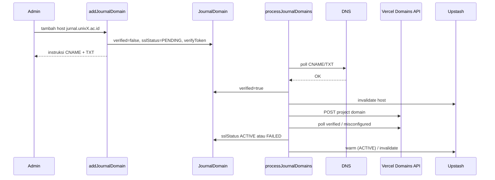

# Sprint 4 — Custom Domain + SSL

| | |
|---|---|
| **Status** | ✅ Selesai |
| **Tanggal** | 2026-06-09 |
| **Roadmap** | `05-repo-shared-roadmap.md` §2 — Fase 1 [Lanjut], S4 |
| **Prasyarat** | ✅ Sprint 3 selesai (`s3-white-label-locale.md`) |

---

## Tujuan

Use-case tambah custom domain per jurnal (`JournalDomain`), instruksi CNAME/TXT untuk klien, verifikasi DNS (cron polling), integrasi Vercel Domains API untuk SSL otomatis, dan invalidasi cache tenant Upstash saat domain berubah.

---

## Deliverable (checklist)

- [x] Use-case `addJournalDomain()` — buat `JournalDomain` + instruksi DNS (CNAME + TXT ownership)
- [x] Use-case `verifyJournalDomainDns()` — cek CNAME/TXT → set `verified`
- [x] Use-case `syncJournalDomainSsl()` — daftar domain ke Vercel + poll `sslStatus` (`PENDING` → `ACTIVE`/`FAILED`)
- [x] Use-case `processJournalDomains()` — orchestrator cron untuk domain pending
- [x] Route cron `GET /api/cron/journal-domains` (auth `CRON_SECRET` / dev open)
- [x] Lookup tenant custom domain: hanya `verified=true` **dan** `sslStatus=ACTIVE`
- [x] Invalidasi + warm cache Upstash saat verifikasi/SSL berubah
- [x] Domain murni: validasi host, instruksi DNS, aturan serving traffic
- [x] Infrastructure: `dns-resolver`, `vercel-domains-client`, `journal-domain-repository`
- [x] Vitest + e2e smoke cron
- [x] Update `06-sprint-log.md`
- [x] DoD: `pnpm lint` + `pnpm typecheck` + `pnpm test`

---

## Lokasi penting

```
apps/jms/
├── vercel.json                                   # cron */10 * * * *
├── src/
│   ├── domain/tenancy/
│   │   ├── custom-domain.ts                      # validasi, DNS instructions, serving rules
│   │   └── types.ts                              # JournalDomainRecord, Add/Verify types
│   ├── application/journal/
│   │   ├── add-journal-domain.ts
│   │   ├── verify-journal-domain-dns.ts
│   │   ├── sync-journal-domain-ssl.ts
│   │   └── process-journal-domains.ts
│   ├── infrastructure/
│   │   ├── dns/dns-resolver.ts
│   │   ├── vercel/vercel-domains-client.ts
│   │   ├── journal/journal-domain-repository.ts
│   │   └── tenancy/
│   │       ├── domain-config.ts                  # JMS_CNAME_TARGET
│   │       ├── journal-lookup.ts                 # filter verified+ACTIVE
│   │       └── journal-lookup-edge.ts
│   └── app/api/cron/journal-domains/route.ts
└── tests/unit/
    ├── custom-domain.test.ts
    ├── vercel-domains-client.test.ts
    ├── journal-domain-use-cases.test.ts
    └── process-journal-domains.test.ts
```

---

## Alur custom domain



Middleware hanya resolve custom domain setelah **DNS verified** dan **SSL ACTIVE**.

---

## Instruksi DNS untuk klien

| Record | Name | Value | Tujuan |
|--------|------|-------|--------|
| CNAME | `{host}` | `JMS_CNAME_TARGET` (default `cname.jms.nsd.id`) | routing trafik |
| TXT | `_jms-verify.{host}` | `verifyToken` dari `addJournalDomain` | bukti kepemilikan |

Verifikasi DNS sukses jika **salah satu** record cocok (TXT ownership atau CNAME routing).

---

## Environment

| Variabel | Fungsi |
|----------|--------|
| `JMS_CNAME_TARGET` | Target CNAME klien (default `cname.jms.nsd.id`) |
| `VERCEL_API_TOKEN` | Token API Vercel |
| `VERCEL_PROJECT_ID` | Project ID deployment JMS |
| `VERCEL_TEAM_ID` | Opsional — team Vercel |
| `CRON_SECRET` | Bearer auth untuk cron (wajib production) |

Tanpa kredensial Vercel, DNS tetap diverifikasi; `sslStatus` tetap `PENDING` sampai API dikonfigurasi.

---

## Verifikasi (Definition of Done)

```bash
pnpm install
pnpm lint
pnpm typecheck
pnpm test
pnpm test:e2e   # smoke cron + existing
```

Manual (staging):

1. `addJournalDomain({ journalId, host })` → salin CNAME/TXT ke DNS klien.
2. Tunggu cron atau panggil `GET /api/cron/journal-domains`.
3. Pastikan `verified=true`, lalu `sslStatus=ACTIVE` setelah Vercel selesai.
4. Akses `{host}` → middleware set `x-journal-id`.

---

## Keputusan & catatan

- Lookup custom domain di S2 (stub) diperketat: hanya domain **verified + SSL ACTIVE** yang melayani trafik (`01-architecture-multitenant.md` §5).
- Cron Vercel: setiap 10 menit via `vercel.json`; non-prod mengizinkan cron tanpa secret.
- UI dashboard admin domain ditunda ke sprint dashboard; use-case siap dipanggil Server Action nanti.

---

## Yang sengaja belum ada (Sprint 5+)

| Item | Sprint |
|------|--------|
| Submission workflow | S5 |
| Dashboard admin UI untuk domain | S3+ / dashboard |
| Hapus / primary domain switch UI | fase lanjut |

---

## Prompt — langkah selanjutnya (Sprint 5)

```
Sprint 4 selesai. Baca documentations/sprints/s4-custom-domain-ssl.md.

Lanjut Sprint 5 (05-repo-shared-roadmap.md §2 — Fase 2):
1. Submission (DRAFT→SUBMITTED), upload file, author metadata.
2. DoD hijau. Jangan lompat sprint kecuali diminta.
```
