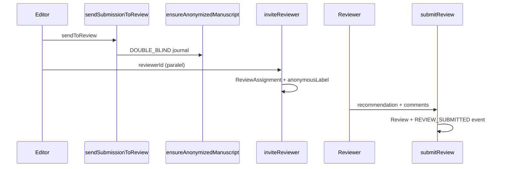

# Sprint 7 — Desk Review, Peer Review & Anonimitas Double-Blind

| | |
|---|---|
| **Status** | ✅ Selesai |
| **Tanggal** | 2026-06-09 |
| **Roadmap** | `05-repo-shared-roadmap.md` §2 — Fase 2, S7 |
| **Prasyarat** | ✅ Sprint 6 selesai (`s6-state-machine.md`) |

---

## Tujuan

Use-case desk review & peer review (invite paralel, submit review) dengan invariant anonimitas double-blind, pipeline anonimisasi naskah, dan UI desk review minimal.

---

## Deliverable (checklist)

- [x] `inviteReviewer()` — `ReviewAssignment` + `SubmissionParticipant` REVIEWER + `anonymousLabel`
- [x] `submitReview()` — `Review` record + assignment `SUBMITTED` via `transitionSubmission`
- [x] `respondReviewInvitation()` — accept/decline assignment
- [x] Desk review: `assignSubmissionToEditor`, `deskRejectSubmission`, `sendSubmissionToReview`
- [x] `ensureAnonymizedManuscript()` — salin naskah + strip metadata PDF + `ANONYMIZED_MANUSCRIPT`
- [x] Domain `assertFieldAllowed` / `forbiddenFieldsForViewer` — guard anonimitas per `reviewModel`
- [x] COI warnings (`detectCoiWarnings`) saat invite — peringatan, bukan blokir
- [x] `commentsToAuthorAppearSafe` — guard kebocoran identitas di komentar
- [x] `buildSubmissionViewForViewer()` — payload reviewer tidak bocorkan author (double-blind)
- [x] UI `/editorial/submissions/[id]` — aksi desk review + invite (dev `?actorId=`)
- [x] E2e smoke `/api/health/review`
- [x] Vitest: `review-domain.test.ts` + `review-workflow.test.ts`
- [x] Update `06-sprint-log.md`
- [x] DoD: `pnpm lint` + `pnpm typecheck` + `pnpm test`

---

## Lokasi penting

```
apps/jms/src/
├── domain/review/
│   ├── anonymity.ts
│   ├── anonymization.ts
│   ├── anonymous-label.ts
│   ├── coi.ts
│   └── comment-safety.ts
├── application/review/
│   ├── invite-reviewer.ts
│   ├── submit-review.ts
│   ├── respond-review-invitation.ts
│   ├── perform-desk-review.ts
│   ├── get-desk-review-detail.ts
│   └── build-submission-view.ts
├── infrastructure/
│   ├── review/review-repository.ts
│   └── submission/anonymization-pipeline.ts
└── app/
    ├── editorial/submissions/[id]/page.tsx
    └── api/health/review/route.ts
```

---

## Alur peer review (ringkas)



---

## Anonimitas (invariant)

| `reviewModel` | Reviewer melihat | Author melihat |
|---------------|------------------|----------------|
| `DOUBLE_BLIND` | `ANONYMIZED_MANUSCRIPT`, tanpa `SubmissionAuthor` | `anonymousLabel` + `commentsToAuthor` |
| `SINGLE_BLIND` | naskah asli + author | label anonim reviewer |
| `OPEN` | semua identitas | semua identitas |

Pipeline: `sendToReview` → `ensureAnonymizedManuscript` (jika double-blind).

---

## Verifikasi (Definition of Done)

```bash
pnpm install
pnpm lint
pnpm typecheck
pnpm test
pnpm test:e2e
```

---

## Keputusan & catatan

- COI = peringatan di payload event, tidak memblokir invite (editor memutuskan).
- Auth UI penuh ditunda; halaman editorial memakai `?actorId=` untuk dev smoke.
- Notifikasi email reviewer ditunda Sprint 9.

---

## Yang sengaja belum ada (Sprint 8+)

| Item | Sprint |
|------|--------|
| `recordDecision` UI + siklus revisi penuh | S8 |
| Notifikasi per tahap | S9 |
| Similarity check integrasi | S16 |

---

## Prompt — langkah selanjutnya (Sprint 8)

```
Sprint 7 selesai. Baca documentations/sprints/s7-review-desk.md.

Lanjut Sprint 8 (05-repo-shared-roadmap.md §2 — Fase 2):
1. Keputusan editor + siklus revisi-resubmit (round) UI/use-case.
2. DoD hijau. Jangan lompat sprint kecuali diminta.
```
