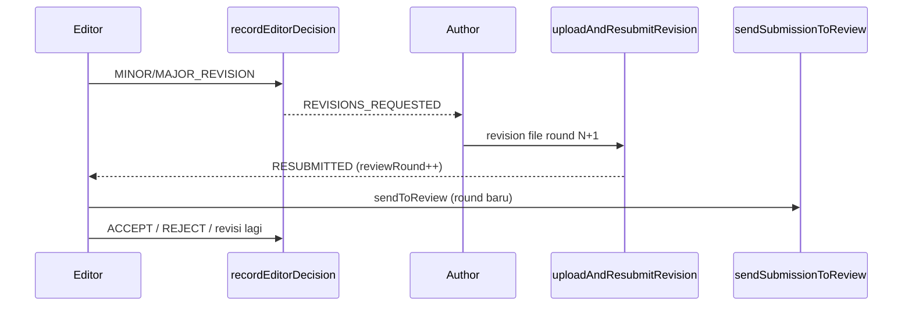

# Sprint 8 — Keputusan Editor & Siklus Revisi-Resubmit (Round)

| | |
|---|---|
| **Status** | ✅ Selesai |
| **Tanggal** | 2026-06-09 |
| **Roadmap** | `05-repo-shared-roadmap.md` §2 — Fase 2, S8 |
| **Prasyarat** | ✅ Sprint 7 selesai (`s7-review-desk.md`) |

---

## Tujuan

Use-case keputusan editor (`recordDecision`) + siklus revisi-resubmit author (`uploadRevision` → `authorResubmit`) dengan UI editorial minimal dan dukungan multi-round.

---

## Deliverable (checklist)

- [x] `recordEditorDecision()` — ACCEPT / MINOR_REVISION / MAJOR_REVISION / REJECT via `transitionSubmission`
- [x] `uploadRevision()` — `SubmissionFile{type:REVISION, round:reviewRound+1}`
- [x] `resubmitRevision()` + `uploadAndResubmitRevision()` — naikkan `reviewRound`, status `RESUBMITTED`
- [x] `getDeskReviewDetail()` diperluas — decisions, revision files, aksi per peran
- [x] UI `/editorial/submissions/[id]` — form keputusan editor + upload revisi author
- [x] `sendToReview` dari `RESUBMITTED` (round berikutnya)
- [x] E2e smoke `/api/health/decision`
- [x] Vitest: `editorial-decision.test.ts` + `revision-workflow.test.ts`
- [x] Update `06-sprint-log.md`
- [x] DoD: `pnpm lint` + `pnpm typecheck` + `pnpm test`

---

## Lokasi penting

```
apps/jms/src/
├── domain/submission/
│   └── editorial-decision.ts          # decision → status mapping
├── application/submission/
│   ├── record-editor-decision.ts
│   ├── upload-revision.ts
│   ├── resubmit-revision.ts
│   └── get-decision-health.ts
├── application/review/
│   └── get-desk-review-detail.ts      # diperluas S8
├── infrastructure/submission/
│   └── file-storage.ts                # buildRevisionStorageKey
└── app/
    ├── editorial/submissions/[id]/    # UI + actions
    └── api/health/decision/route.ts
```

---

## Alur siklus revisi (ringkas)



---

## Verifikasi (Definition of Done)

```bash
pnpm install
pnpm lint
pnpm typecheck
pnpm test
pnpm test:e2e
```

---

## Keputusan & catatan

- `authorResubmit` wajib ada file `REVISION` untuk round `reviewRound + 1` (guard state machine S6).
- UI author: satu form upload + resubmit; editor: tombol keputusan + send to review dari `RESUBMITTED`.
- Notifikasi keputusan ke author ditunda Sprint 9.

---

## Yang sengaja belum ada (Sprint 9+)

| Item | Sprint |
|------|--------|
| Notifikasi per tahap (email + in-app) | S9 |
| Pengingat reviewer overdue (cron) | S9 |
| Issue, galley, publish | S10 |

---

## Prompt — langkah selanjutnya (Sprint 9)

```
Sprint 8 selesai. Baca documentations/sprints/s8-editorial-decision.md.

Lanjut Sprint 9 (05-repo-shared-roadmap.md §2 — Fase 2):
1. Notifikasi per tahap (in-app + email) + pengingat reviewer (cron).
2. DoD hijau. Jangan lompat sprint kecuali diminta.
```
